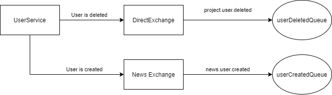

#User Service

## REST API

### NO Authentication required
* POST /login 
    * Required Body ```{ "username":"<username>", "password":"<password>" }```
    * Returns JWT Token
* POST /user/register
    * Required Body ```{ "username":"<username>",  "password":"<password>" "email":"<email>"}```
    * Returns User
### Authentication required
Required in Http Header 

Authentication: <JWT Token>

* POST /user
    * Required Body ```{ "username":"<username>",  "password":"<password>" "email":"<email> "role":"<role>}```
    * Returns User 
* PUT /user/{uuid}
    * Required Body ```{ "username":"<username>",  "password":"<password>" "email":"<email> "role":"<role>}```
    * Returns User
* GET /user/
    * Returns list of Users
* GET /user/{uuid}
    * Returns User
* DELETE /user/{uuid}
    * Returns Boolean of deletion success

### Authentication of User with Role Admin required

* PUT /user/elevate/{uuid}
    * Required Body ```{ "role":"<role>" }```
    * Returns User

## Messaging

All Queues are reachable by the exchange `direct-exchange`

ProjectService queues:

* userDeletedQueue

Routing-Keys:
* user.deleted




### Message Format

User Deleted
```json
{
  "uuid": "71bfdfa9-6be2-4e9e-8534-74aed69f39f9"
}
```